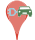
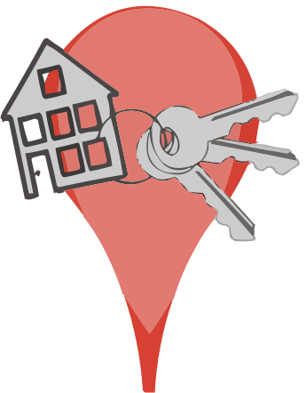
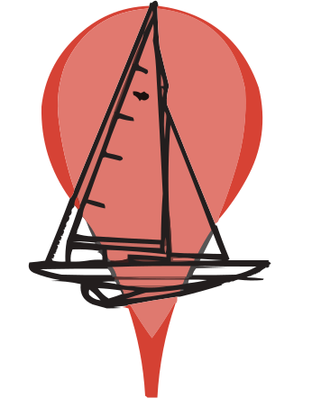
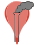
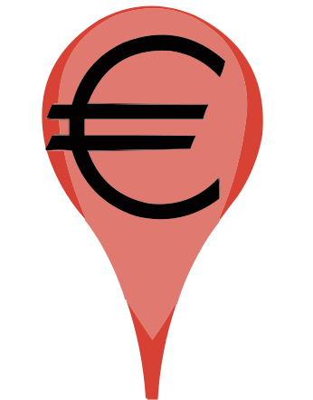
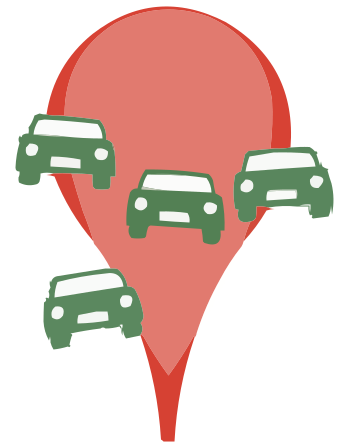
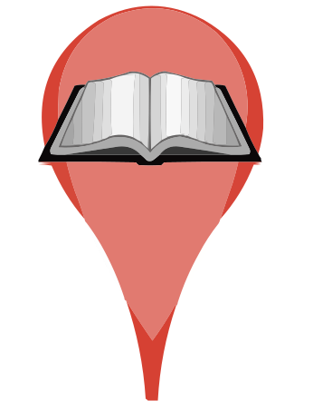

# Bouwmelding.nl: vergunningen op de kaart

Bekijk vergunningen aangevraagd en verleend in uw omgeving. Demo op <https://bouwmelding.nl/>.

## Legenda

-  Aangevraagde vergunning, of aankondiging uitstel besluit.
-  Exploitatie-, of alcoholvergunning.
-  Bed & Breakfast, of vakantieverhuur.
-  Oplaadplaats elektrisch vervoermiddel.
-  Evenement.
-  Kapvergunning.
-  Onttrekkingsvergunning, meestal kamerverhuur.
-  Ligplaats- & watervergunning.
-  Milieuvergunning.
-  Reservering parkeerplek, of tijdelijke verkeersmaatregel.
-  Reclamevergunning.
-  Verkeersbesluit.
-  Bouwvergunning.
-  De rest. Meldingen, verordeningen en overige besluiten.
