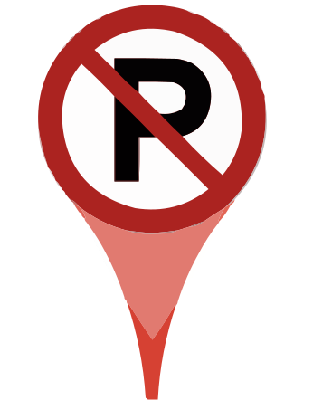
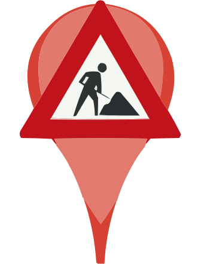

# Recent verleende vergunningen op de kaart

Bekijk vergunningen aangevraagd en verleend in uw omgeving.

<https://basgroot.github.io/bekendmakingen/>

## Legenda

-  Aangevraagde vergunning, of aankondiging uitstel besluit.
-  Reservering parkeerplek, of tijdelijke verkeersmaatregel.
-  Exploitatie-, of alcoholvergunning.
-  Bed & Breakfast, of vakantieverhuur.
-  Evenement.
-  De rest. Meestal bouwvergunningen.
